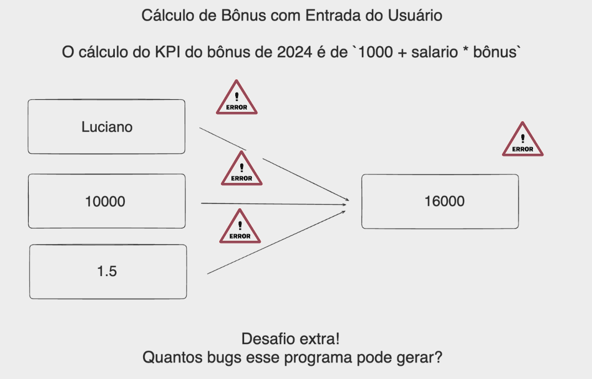

### Challenge - Refactor the project from the previous lesson to avoid bugs!

To resolve the identified bugs — handling invalid inputs that cannot be converted to a floating point number and preventing negative values ​​for salary and bonus, you can modify the code directly. This involves adding additional checks after the conversion attempt to ensure that the values ​​are positive.



```python
# Prompt the user to enter their name
try:
name = input("Enter your name: ")

# Check if the name is empty
if len(name) == 0:
raise ValueError("Name cannot be empty.")
# Check if there are numbers in the name
elif any(char.isdigit() for char in name):
raise ValueError("Name must not contain numbers.")
else:
print("Valid name:", name)
except ValueError as e:
print(e)

# Prompt the user to enter the value of their salary and convert it to float

try:
salary = float(input("Enter the value of your salary: "))
if salary < 0:
print("Please enter a positive value for the salary.")
except ValueError:
print("Input "Invalid input for salary. Please enter a number.")

# Prompt the user to enter the amount of the bonus received and convert to float
try:
bonus_received = float(input("Enter the amount of the bonus received: "))
if bonus_received < 0:
print("Please enter a positive amount for the bonus.")
except ValueError:
print("Invalid input for bonus. Please enter a number.")

# Assuming a calculation logic for the final bonus and KPI
bonus_final = bonus_received * 1.2 # Example, adjust as needed
kpi = (salary + final_bonus) / 1000 # Simple KPI example

# Print the information to the user
print(f"Your KPI is: {kpi:.2f}")
print(f"{name}, your salary is R${salary:.2f} and your final bonus is R${final_bonus:.2f}.")
```