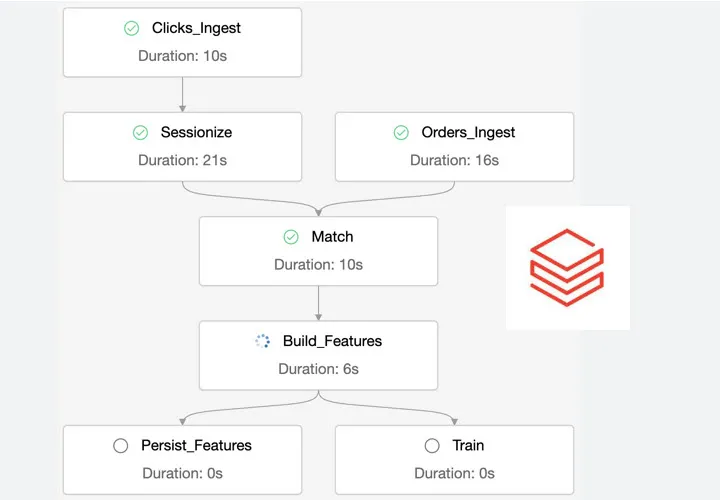
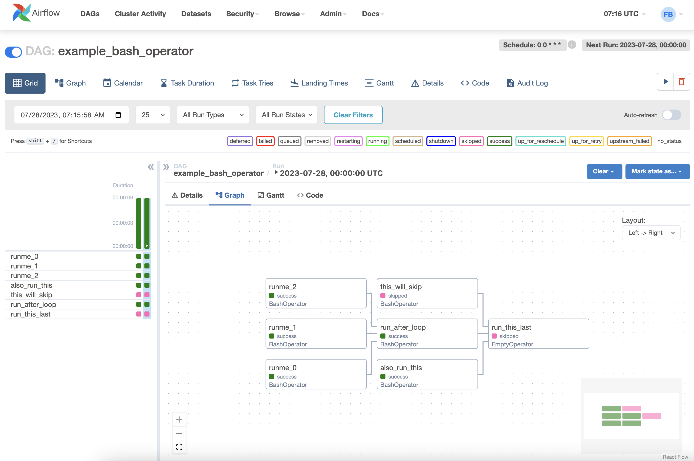

# Lesson 03: DEBUG, IF, FOR, While, Lists and Dictionaries in Python

We will explore control flow structures such as if, for, and while.

We use Control Flow structures to make decisions!

Databricks has workflow


Airflow main workflow tool


### Control Flow Structures

We will explore how to use `if` to make decisions based on conditions, `for` to iterate over sequences of data, and `while` to execute blocks of code while a condition is true.

To learn more:
[Doc](https://docs.python.org/pt-br/3/tutorial/controlflow.html)

## Control Flow Structures

The if is a fundamental conditional structure in Python that evaluates whether a condition is true and, if so, executes a block of code. If the initial condition is not true, you can use elif (else if) to check for additional conditions, and else to execute a block of code when none of the previous conditions are true.

Probably the most well-known control flow statement is the if. For example:

```python
x = int(input("Please enter an integer: "))

if x < 0:
x = 0
print('Negative changed to zero')
elif x == 0:
print('Zero')
elif x == 1:
print('Single')
else:
print('More')
```